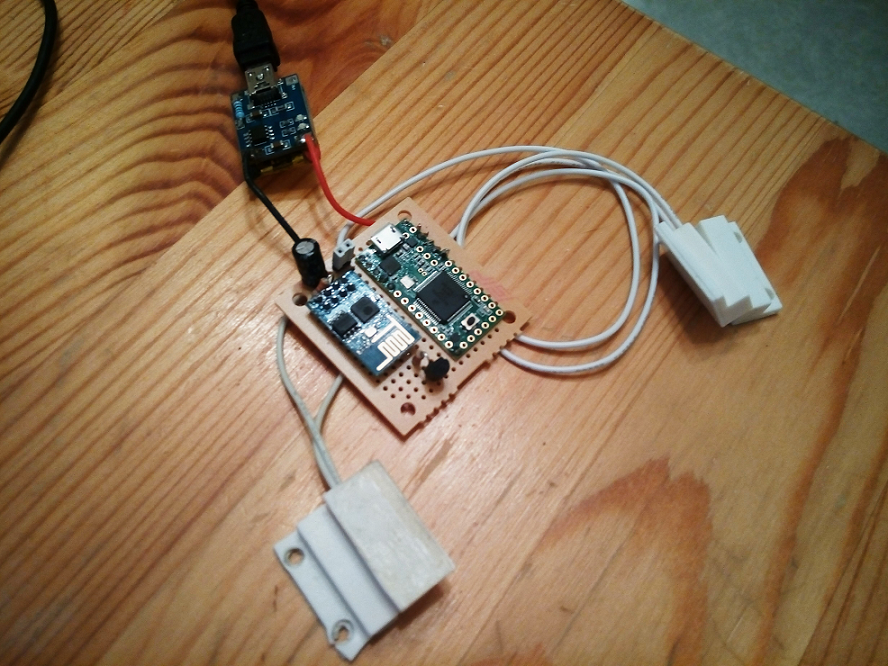

This project aims at creating a monitor for a home front door capable of reporting to a mobile phone activity through such door. In particular, for a double door entrance, it should report wether someone entered or exited the house.

The picture below shows the completed assembly. One the sides are the reed relays that sense the status of the doors. The blue module on the right is the ESP8266, the WiFi module.

Delivering a message to mobile
=========================

Message delivery can be achieved in several ways. One, that would be a good candidate to gain some experience in Android development, is to use Google Cloud Messaging (GCM) and then build a service application listening for GCM messages. Since I had already explored this area in other projects I decided to try something different. So I came across "Pushover" which offers an Android client ($4.99), HTTP API and free messages up to what amounts to a very large cap for a personal application like this, that is 7500 messages per month. As I live in a private home and not a railway station those should do.

The API is a REST HTTP API and uses OAuth for authentication. The issue here is that, for clearly valid reasons, the API is offered only through HTTPS, and there is no way I am going to implement SSL in an Arduino sketch. This problem would have presented itself anyway also if I had decided to implement a GCM based solution obviously. The fix was to use an intermediate entity, in this case a RaspberryPI that was already sitting in my home network for other purposes. So I made the DoorMonitor to make a plain HTTP request just notifying the door event to a PHP script that eventually then used CURL to create a pushover request.

This might sound a bit articulated and, in fact, if the RaspberryPI had to be introduced on purpose it would completely void the all idea of having a cheap WiFi module. On the other hand there is not much to do around it as any service available at the moment to push messages to a mobile phone makes use of some sort of encrypted connection, and we don't argue with that. As a bonus now requests pass through a script I own, so I can there log the information for instance in a database, thing that wouldn't have been possible by sending the message request directly to Pushover.

Since my WiFi is encrypted and the RaspberryPI was running only on the inside network this solution is sound enough and works for me. Should one want to host the PHP script on a public server he would open though a hole that would allow anyone with a browser to flood his phone with messages. This could be solved by authenticating messages with an HMAC and a rolling code (or other form of nonce). Messages could be still be eavesdropped but they couldn't be faked. I will not include this in this release but I plan to have it as an example and possibly to use it in other projects of mine. HMAC is easily computable also on a limited resoueces platform as the ones we are considering here.
